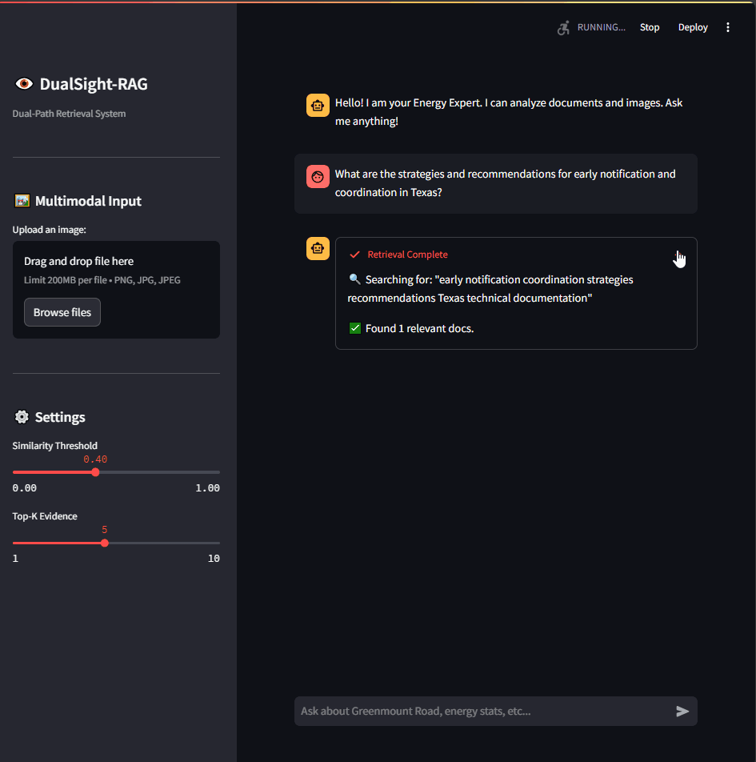

# 👁️ DualSight-RAG

<div align="center">


**Full-Stack SigLIP Multimodal RAG with Fragment-First Retrieval & Score Aggregation.**

[Key Features](#-key-features) • [Architecture](#-architecture) • [Quick Start](#-quick-start) • [Performance](#-performance) • [Project Structure](#-project-structure) • [License](#-license)


</div>

---

## 📖 Introduction

**DualSight-RAG** is a high-performance **multimodal RAG** system designed for dense, detail-sensitive retrieval (e.g., charts, technical docs, long reports).

Instead of indexing whole documents, DualSight adopts a **Fragment-First** strategy:

- **Index fragments (chunks)** rather than entire documents
- Retrieve **Top-N fragments**, then **aggregate** them into document-level scores
- Use **SigLIP** as a *unified encoder* for both **text** and **image**, avoiding heavy cross-encoder rerankers while maintaining strong recall

**Pipeline**  
**Query → Fragment Retrieval (Top-N) → Group-by DocID → Score Aggregation → Dual-Path Fusion → Multimodal LLM Generation**

---

## 🎬 Demo


<p align="center">
  
</p>

---

## 🚀 Key Features

### 1) ⚡ Unified SigLIP Retrieval (Text + Image)

A single encoder handles both modalities:

- **Visual path:** text-to-image retrieval in a shared embedding space  
- **Text path:** text-to-text fragment retrieval via dense similarity  
- **Unified space:** no projection / adapter layers required

### 2) 🧩 Fragment-First Retrieval + Aggregation

To mitigate **lost-in-the-middle** behavior and better cover long documents:

- **Ingestion:** slice long text into overlapping **fragments** before indexing
- **Retrieval:** retrieve **Top-N fragments** (instead of Top-K documents)
- **Aggregation:** group fragments by `doc_id` and compute a document score

**Default aggregation (peak + coverage):**

\[
s(d)=\max_{i \in \mathcal{F}(d)} s_i \;+\; \frac{1}{K}\sum_{i \in \text{TopK}(\mathcal{F}(d))} s_i
\]

- \( \mathcal{F}(d) \): retrieved fragments belonging to document \(d\)  
- \( s_i \): similarity score for fragment \(i\)  
- `TopK`: top-K fragments within the same document

### 3) ⚖️ Weighted Dual-Path Fusion

Final ranking combines **visual** and **text** evidence:

\[
S(d)=\alpha \cdot S_{\text{visual}}(d) + (1-\alpha)\cdot S_{\text{text}}(d)
\]

This helps retrieve chart-heavy pages even when OCR/text is noisy, and vice versa.

### 4) 🚀 Hardware-Isolated Inference (Optional)

Recommended deployment for stable throughput:

- **GPU 0:** SigLIP (embedding + retrieval)
- **GPU 1–2:** vLLM multimodal generation (tensor parallel)

This prevents retrieval latency from blocking generation.
---

## 🛠️ Architecture

<p align="center">
  <a href="assets/Architecture.jpg">
    
  </a>
</p>

---

## 📂 Project Structure

```text
DualSight-RAG/
├── assets/
├── configs/
│   └── config.py           # Model paths and runtime settings
├── core/
│   ├── retrieval.py        # Fragment search, group-by, aggregation, fusion
│   └── llm_engine.py       # vLLM inference wrapper (optional)
├── scripts/
│   ├── ingest.py           # Chunking -> SigLIP encoding -> FAISS build
│   └── evaluate.py         # Recall/MRR evaluation
├── web_ui/
│   └── app.py              # Streamlit UI (scores + retrieval breakdown)
├── requirements.txt
└── README.md
```

---

## 📦 Quick Start

### 1) Prerequisites

- Python 3.10+
- GPU recommended (SigLIP + VLM)
- RAM: 64GB+ recommended for larger FAISS indices

### 2) Install

```bash
pip install -r requirements.txt
```

### 3) Configure (`configs/config.py`)

```python
MODEL_PATHS = {
    "vlm":   "/path/to/your_multimodal_llm",
    "siglip": "/path/to/siglip-so400m-patch14-384"
}

RETRIEVAL = {
    "top_n_fragments": 100,
    "top_k_context": 5,
    "agg_topk": 5,
    "alpha_fusion": 0.5
}
```

### 4) Build Fragment Index

This generates FAISS indices and the fragment-to-document mapping:

```bash
python scripts/ingest.py --dataset energy
```

### 5) Run Demo UI

```bash
streamlit run web_ui/app.py
```

---

## 📊 Performance

Results on a vertical-domain dataset (complex charts/tables/text).  
**All numbers are consistent with the resume version of this project.**

| Category | Metric | Result | What it reflects |
|---|---|---:|---|
| Retrieval quality | Recall@5 | **42.33% → 85.9%** | Dual-index retrieval + chunked aggregation rerank |
| Ranking quality | MRR@50 | **+0.16** | Improvement vs. baseline pipeline |
| End-to-end | F1 | **+0.14** | Improvement vs. baseline with vLLM (TP=2) deployment |
| Context | Evidence size | **Top-5** | Final context selected after reranking + aggregation |

> Note: Exact dataset details and baseline configuration can be provided in `scripts/eval.py` (sanitized if needed).


---

## 📝 To-Do

- [x] Unified SigLIP dual-path retrieval
- [x] Fragment indexing + group-by aggregation
- [x] Mathematical score aggregation
- [ ] Adaptive `alpha` based on query type/length
- [ ] On-the-fly PDF chunking & indexing

---

## 🤝 Contributing

Issues and PRs are welcome.  
Please include minimal repro steps and environment info.

---

## 📄 License

Apache-2.0

