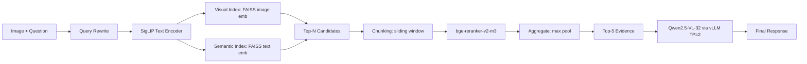

# 👁️ DualSight-RAG

<div align="center">


**Unified-space Multimodal RAG with Dual-Index Retrieval and Chunked Aggregation Reranking.**

[Features](#-key-features) • [Architecture](#-architecture) • [Quick Start](#-quick-start) • [Performance](#-performance) • [License](#-license)

</div>

---

## 📖 Introduction

**DualSight-RAG** is a multimodal Retrieval-Augmented Generation (RAG) system for complex document understanding (e.g., charts, tables, and dense text).  
It addresses two common failure modes in multimodal RAG:

- **Query ambiguity**: rewrite user queries to reduce ambiguity before retrieval.
- **Long-document matching**: chunk candidates and aggregate reranking scores to mitigate truncation effects.

Pipeline overview: **Query Rewrite → Dual-Index Retrieval → Chunked Rerank → Top-K Evidence → VLM Generation**.

---

## 🎬 Demo

> Place your demo GIF at: `assets/demo.gif`

<p align="center">
  
</p>

---

## 🚀 Key Features

### 1) 🌌 Dual-Index Retrieval in a Unified Alignment Space (SigLIP)
We build two indices in the **same SigLIP embedding space**:

- **Text→Image path**: encode raw images into SigLIP image embeddings for visual/layout retrieval.
- **Text→Text path**: encode textual evidence (e.g., extracted descriptions) into SigLIP text embeddings for semantic retrieval.

This enables **Text-to-Image** and **Text-to-Text** retrieval without switching embedding models.

### 2) 🧩 Chunked Aggregation Reranking (bge-reranker-v2-m3)
To handle long candidates, we implement **chunk scoring + aggregation**:

- Split long candidate text into overlapping chunks.
- Score each chunk with **bge-reranker-v2-m3**.
- Aggregate chunk scores (e.g., max-pooling) to produce the final relevance score.
- Select **Top-5 evidence** as the generation context.

> This strategy improved **Recall@5 from 42.33% to 85.9%** on a vertical-domain dataset (vs. baseline pipeline).

### 3) ⚡ High-Throughput VLM Serving (vLLM, TP=2)
We deploy **Qwen2.5-VL-32** with **vLLM** using **Tensor Parallelism (TP=2)**.  
Retrieval/rerank and generation can be decoupled for scalable serving.

---

## 🛠️ Architecture



---

## 📂 Project Structure

```text
DualSight-RAG/
├── assets/                 # Demo images, diagrams, and demo GIF
├── configs/                # Configuration files
│   └── config.py           # Model paths & runtime settings
├── core/                   # Core engines
│   ├── retrieval.py        # Dual-index retrieval (SigLIP)
│   ├── reranker.py         # Chunked aggregation reranking (BGE reranker)
│   └── llm_engine.py       # vLLM inference wrapper
├── scripts/
│   ├── ingest.py           # Ingestion: build indices
│   └── evaluate.py         # Benchmark & evaluation
├── web_ui/
│   └── app.py              # Streamlit demo UI
├── requirements.txt
└── README.md
```

---

## 📦 Quick Start

### 1) Prerequisites
- Python 3.10+
- CUDA 12.x recommended
- NVIDIA GPUs recommended for VLM serving (TP=2 implies **≥2 GPUs** for best performance)

### 2) Installation
```bash
git clone https://github.com/<YourUsername>/DualSight-RAG.git
cd DualSight-RAG
pip install -r requirements.txt
```

### 3) Configuration
Edit `configs/config.py` to point to your local model weights:

```python
MODEL_PATHS = {
    "qwen": "/path/to/Qwen2.5-VL-32B-Instruct-AWQ",
    "siglip": "/path/to/siglip-so400m-patch14-384",
    "reranker": "/path/to/bge-reranker-v2-m3",
}
```

### 4) Build Indices
Place your raw data under `raw_data/<dataset_name>/` and run:
```bash
python scripts/ingest.py --dataset <dataset_name>
```

### 5) Run the Web UI
```bash
streamlit run web_ui/app.py
```

---

## 📊 Performance

Results on a vertical-domain dataset (complex charts/tables/text).  
**All numbers are consistent with the resume version of this project.**

| Metric | Result | Setting / Note |
|---|---:|---|
| Recall@5 | **42.33% → 85.9%** | Dual-index retrieval + chunked aggregation rerank |
| MRR@50 | **+0.16** | Improvement vs. baseline pipeline |
| End-to-end F1 | **+0.14** | Improvement vs. baseline, with vLLM (TP=2) deployment |
| Evidence for generation | **Top-5** | Selected after reranking + aggregation |

> Note: Exact dataset details and baseline configuration can be provided in `scripts/evaluate.py` (sanitized if needed).

---

## 🔁 Reproducibility

This repository provides a **sanitized and reproducible** pipeline consistent with the resume version of this project.

### Environment
- Python 3.10+
- CUDA 12.x recommended
- Models (configured via `configs/config.py`):
  - `Qwen2.5-VL-32B-Instruct-AWQ`
  - `siglip-so400m-patch14-384`
  - `bge-reranker-v2-m3`

### Evaluation Protocol (Recommended)
- Build indices with `scripts/ingest.py`
- Run evaluation with `scripts/evaluate.py`
- Use **Top-5 evidence** after reranking + aggregation as the generation context

### Baseline Definition (for reported deltas)
To keep metrics aligned with the resume:
- **Baseline (single-path + no chunk aggregation rerank)**:
  - No query rewrite
  - Single-path retrieval (one index only)
  - No chunked aggregation reranking (or truncation-limited matching)
- **DualSight-RAG (full)**:
  - Query rewrite enabled
  - Dual-index retrieval (visual + semantic)
  - Chunked reranking + aggregation
  - Top-5 evidence for generation context
  - vLLM serving with TP=2 for Qwen2.5-VL-32

---

## 🧪 Ablation Study

Ablations validate the contribution of each component under the same evaluation protocol.  
**Final numbers below follow the resume-consistent reporting.**

| Variant | Query Rewrite | Dual-Index Retrieval | Chunked Agg. Rerank | Recall@5 | MRR@50 (Δ vs baseline) | End-to-end F1 (Δ vs baseline) |
|---|---:|---:|---:|---:|---:|---:|
| Baseline (resume) | ✗ | ✗ (single-path) | ✗ | 42.33% | 0.00 | 0.00 |
| w/o Query Rewrite | ✗ | ✓ | ✓ | TBD | TBD | TBD |
| w/o Dual-Index (single-path) | ✓ | ✗ | ✓ | TBD | TBD | TBD |
| w/o Chunk Aggregation (truncate / no agg) | ✓ | ✓ | ✗ | TBD | TBD | TBD |
| **DualSight-RAG (full)** | ✓ | ✓ | ✓ | **85.9%** | **+0.16** | **+0.14** |

---

## 📝 To-Do
- [x] Dual-index retrieval (SigLIP)
- [x] Chunked aggregation reranking (bge-reranker-v2-m3)
- [x] vLLM integration (TP=2)
- [ ] PDF parsing & layout-aware chunking
- [ ] Optional web search connector

---

## 🤝 Contribution
Issues and PRs are welcome. For large changes, please open an issue first to discuss the design.

---

## 📄 License
This project is licensed under the **Apache 2.0 License**.
